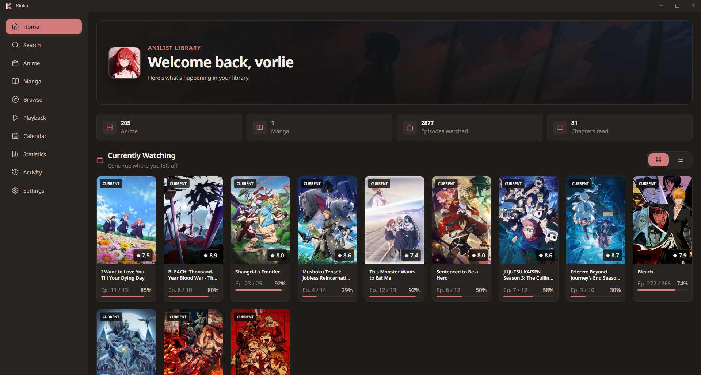

# Kioku

<div align="center">

[](https://github.com/vorlie/kioku)
[](https://react.dev/)
[](https://www.typescriptlang.org/)
[](https://tauri.app/)
[](https://anilist.co/)

</div>

<p align="center">
  
</p>

Kioku is a desktop app for managing an AniList library with a focused, native-feeling interface for anime and manga tracking.

It combines a React + Vite frontend with a Tauri 2 desktop shell and a Rust backend for local app functionality and AniList integrations.

## Overview

Kioku is designed to feel like a dedicated desktop client rather than a simple web wrapper. The app focuses on:

- browsing and managing AniList anime and manga libraries
- searching and inspecting media details
- checking library stats and profile overview
- tracking progress and list status
- keeping the interface lightweight and desktop-first

## Why Kioku

Kioku was built for people who want a cleaner, faster, and more focused alternative to managing AniList in the browser. It brings together media browsing, library tracking, statistics, and desktop app UX in one place without the noise of a generic web portal.

It is especially useful if you want:

- a more app-like experience for managing anime and manga libraries
- quick access to your AniList data without browser clutter
- a polished desktop interface built around media discovery and tracking
- a project that keeps the frontend and native runtime intentionally separated

## Features

- Anime library management
- Manga library management
- Search across AniList media
- Detail pages for media entries
- Dashboard with profile and statistics
- Activity viewing and timeline-related areas
- Theme switching and custom visual styles
- Desktop-first layout with a polished UI

## Tech stack

### Frontend

- React 19
- TypeScript
- Vite
- React Router
- Lucide React

### Desktop / runtime

- Tauri 2
- Rust
- AniList GraphQL API

## Requirements

Before running the app, make sure the following are installed:

- Node.js 20 LTS or newer
- npm
- Rust stable toolchain
- A C++ build environment for Tauri on Windows/macOS/Linux

### Windows-specific notes

On Windows, the following are typically required for Tauri builds:

- Visual Studio 2022 Build Tools
- Desktop development with C++ workload
- Windows 10/11 SDK

> If the Tauri build fails on your machine, make sure the Rust toolchain and Visual Studio C++ toolchain are installed correctly.

## Quick start

### Windows

```powershell
git clone https://github.com/vorlie/kioku.git
cd kioku
npm install
npm run tauri dev
```

> On Windows, install Visual Studio 2022 Build Tools with the Desktop development with C++ workload before running Tauri builds.

### macOS

```bash
git clone https://github.com/vorlie/kioku.git
cd kioku
npm install
npm run tauri dev
```

> macOS users may need Xcode Command Line Tools installed for native build dependencies.

### Linux

```bash
git clone https://github.com/vorlie/kioku.git
cd kioku
npm install
npm run tauri dev
```

> On Linux, ensure the Tauri prerequisites for your distro are installed, including build tools and libraries required by the desktop runtime.

## Installation

Clone the repository and install frontend dependencies:

```bash
git clone https://github.com/vorlie/kioku.git
cd kioku
npm install
```

## Development

### Run the frontend in Vite

```bash
npm run dev
```

This starts the Vite development server for the web UI.

### Run the desktop app with Tauri

```bash
npm run tauri dev
```

This launches the desktop application and connects the web frontend to the Tauri runtime.

## Production build

### Frontend build

```bash
npm run build
```

### Desktop app build

```bash
npm run tauri build
```

This produces the application bundle for the Tauri desktop app.

## Dependency reference

### JavaScript / frontend dependencies

| Package | Version | Purpose |
| --- | --- | --- |
| `react` | `^19.1.0` | UI library |
| `react-dom` | `^19.1.0` | React DOM rendering |
| `react-router-dom` | `^7.18.2` | Client-side routing |
| `lucide-react` | `^1.31.0` | Icon set |
| `hls.js` | `^1.7.1` | HLS playback support |
| `@tauri-apps/api` | `^2` | Tauri frontend API |
| `@tauri-apps/plugin-opener` | `^2` | Open external links |
| `@tauri-apps/plugin-shell` | `^2` | Shell integration |

### Development dependencies

| Package | Version | Purpose |
| --- | --- | --- |
| `vite` | `^7.0.4` | Frontend build tooling |
| `typescript` | `~5.8.3` | Type safety and compile checks |
| `@vitejs/plugin-react` | `^4.6.0` | Vite React support |
| `@types/react` | `^19.1.8` | React TypeScript types |
| `@types/react-dom` | `^19.1.6` | React DOM TypeScript types |
| `@types/hls.js` | `^0.13.3` | HLS type definitions |
| `@tauri-apps/cli` | `^2` | Tauri CLI for dev/build commands |

### Rust dependencies

| Package | Version | Purpose |
| --- | --- | --- |
| `tauri` | `2` | Desktop app framework |
| `tauri-plugin-opener` | `2` | External URL handling |
| `tauri-plugin-shell` | `2` | Shell operations |
| `reqwest` | `0.12` | HTTP client |
| `tokio` | `1` | Async runtime |
| `serde` / `serde_json` | `1` | Serialization |
| `anyhow` | `1` | Error handling |
| `thiserror` | `1` | Error derivation |
| `tracing` / `tracing-subscriber` | `0.1` / `0.3` | Logging |
| `ani_lib` (`ani-cli-rs`) | `0.11.0` | AniList / media-related Rust integration |

## Project structure

```text
.
├── assets/               # Project preview and marketing images
├── src/                  # React frontend source
├── src-tauri/            # Tauri app and Rust backend
├── public/               # Static public assets
├── index.html            # Vite entry HTML
├── package.json          # Frontend scripts and dependencies
├── tsconfig.json         # TypeScript config
├── vite.config.ts        # Vite configuration
├── README.md             # Project documentation
├── anilist-schema.graphql # AniList schema reference
└── src-tauri/Cargo.toml  # Rust project configuration
```

## AniList integration

Kioku uses the [AniList GraphQL API](https://anilist.co/) to access user data, library entries, media metadata, and related information. In the app, users authenticate with their AniList account to sync and manage their personal library.

## License

No license has been declared in the repository metadata yet, so licensing information is currently unspecified.

## Status

This project is under active development and the interface and feature set may change over time.
